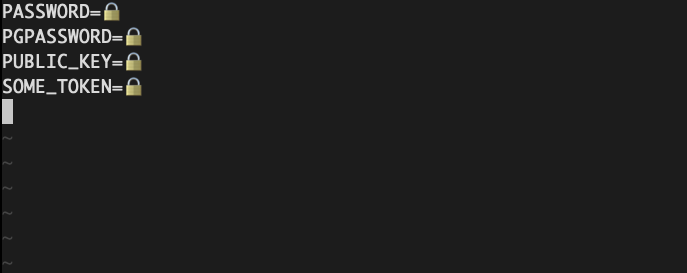
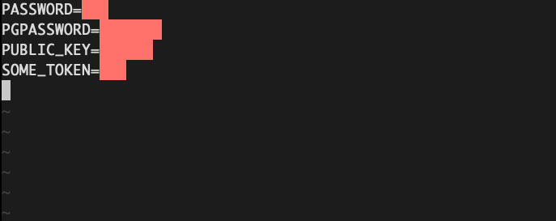

# vim-conceal-secrets

A simple plugin for hiding secrets, passwords, etc.

## Supported filetypes

* `sh` - bash scripts, .envrc, .env files

## Usage

```
:ConcealSecrets
```
Conceal secret contents. Secrets are concealed by default.




```
:RevealSecrets
```

Reveal secret contents, obscured with the same foreground/background color. Use this to copy secret values to a register or external program (copy/paste).



